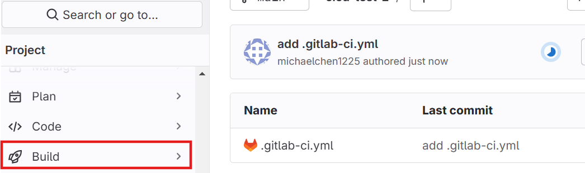
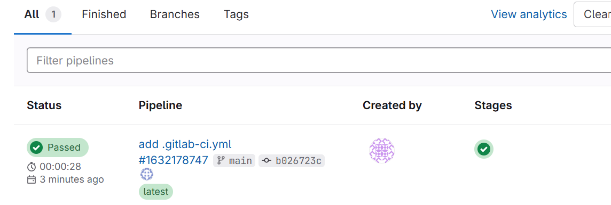
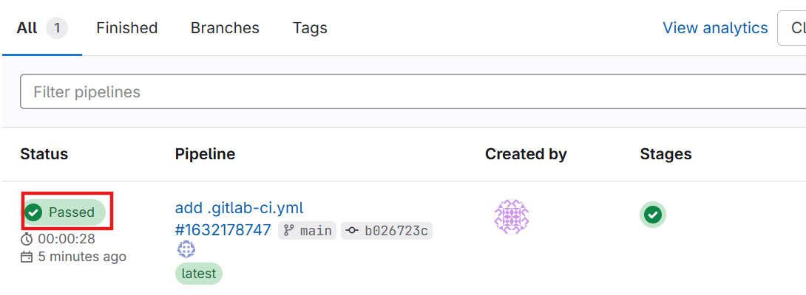
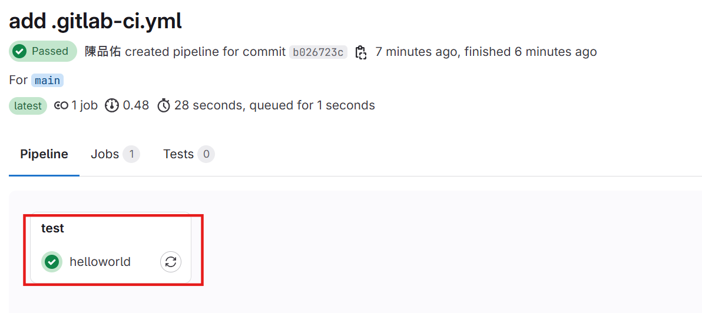
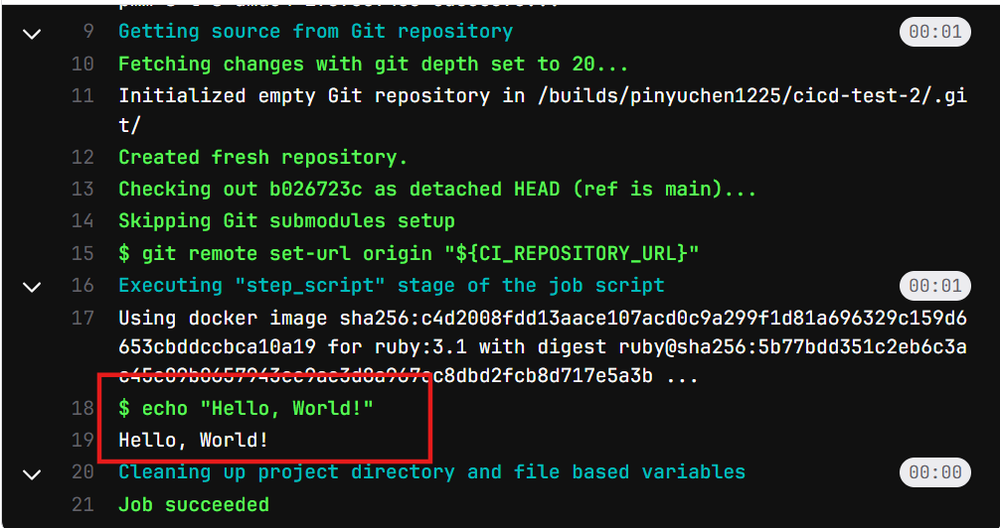

# GitLab CI/CD 

## 前置作業

1. 註冊 GitLab 帳號

2. 開一個新的專案

3. 在新專案中創建一個名為 `.gitlab-ci.yml` 的檔案

4. 準備完成

## 主角：.gitlab-ci.yml

CI/CD 說白了就是一個自動化的流程，學過 Linux 的話就知道這類似 shell script 的概念，而 GitLab CI/CD 的「script」就是用 yaml 語言寫的，內容就是：

> **當程式碼被 push 到 GitLab 時，會發生什麼事？**

當 Gitlab 偵測到你的專案有這個 .gitlab-ci.yml 檔案，就會自動開始執行我們定義好的流程。

而 .gitlab-ci.yml 裡面跑的流程就稱為**Pipeline**，Pipeline的組成要素就是**Job**：

* 一個 Job 就是一個任務，可以是編譯、測試、部署等等。舉例而言，你想要編譯一個 C 語言程式，可以先定義好一個叫做「compile」的 Job，然後在這個 Job 中寫下編譯的指令：gcc main.c -o main。

* 若只是單純的定義多個 Job，這些 Job 彼此之間沒有任何相依性 or 先後順序，GitLab 會同時執行這些 Job。

* 如果想要讓 Job 依序執行，可以設置 **stages**，Job 會依照 stages 的順序執行。舉例而言：

  * stage 1
    * job A
    * job B

  * stage 2
    * job C

> 上面表示了兩個 stage 與三個 Job，Job A 與 Job B 會同時執行，只有當 Job A 與 Job B 都執行完且正確後，Job C 才會執行。

## 第一個 Pipeline

確定在 Gitlab 上建置好專案、創建好 .gitlab-ci.yml 後，就可以開始寫第一個 Pipeline 了。

* 在 .gitlab-ci.yml 中寫下以下內容：

```yaml
helloworld:  # Job 的名稱，可以自訂
    script:  # 固定寫法
        - echo "Hello, World!"
```

> 定義了一個 Job 名為 helloworld，執行 echo "Hello, World!"。

* 將 .gitlab-ci.yml push 到 GitLab 上：

```bash
git add .
git commit -m "add .gitlab-ci.yml"
git push
```

* 打開瀏覽器上的 GitLab，進入專案頁面，點選左測欄位的「Build」(火箭)，展開後點選「Pipelines」，就可以看到剛剛 push 的 Pipeline。


    

    

* 等他跑一下，過個30秒刷新一下頁面，出現綠色勾勾後點進去(點選下圖的紅框)：

    

* 然後就會看到我們剛剛建立的 helloworld Job：

    

* 點選上圖的紅色框框，就可以看到 Job 的執行結果，也就是我們輸出的 Hello, World!：

    

> 其實 GitLab 在執行 Job 時，會在背景建立一個 Docker container，然後在這個 container 中執行我們的指令。預設的 image 是 ruby (我也不知道為甚麼)，如果你想要執行特定程式語言的執行環境，例如 Python、Node.js 等等，可以在 .gitlab-ci.yml 中指定 image，例如：

```yaml
python-job:
    image: python:3.8 # 讓GitLab使用 python:3.8 的 image 來提供底下指令的執行環境
    script:
        - python --version
```

其他的語法都會整理在[下一篇](https://github.com/michaelchen1225/CICD/blob/main/GitLab%20CICD/Gitlab-cicd-note-github/02.md)。
