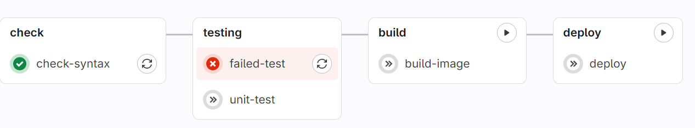
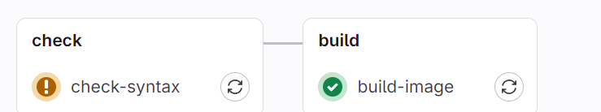
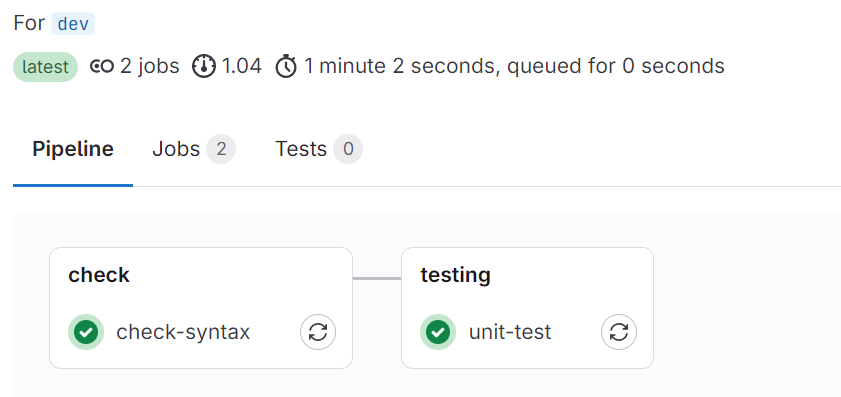

# GitLab CI/CD 

## 最簡單的腳本

```yaml
helloworld:  # Job 的名稱，可以自訂
    script:  # 固定寫法
        - echo "Hello, World!"
```

## 多個 Job

```yaml
bad-job:
    script:
        - fffffff  # 故意寫錯


helloworld:  # Job 的名稱，可以自訂
    script:  # 固定寫法
        - echo "Hello, World!"

goodbye:  # Job 的名稱，可以自訂
    script:  # 固定寫法
        - echo "Goodbye!"
```
> 由於 bad-job 有錯誤，所以會失敗，但因為和後續的 Job 無關，所以後續的 Job 會繼續執行。


## before_script & after_script

```yaml
hello:  
    before_script:  # Job 執行前會先執行的指令
        - echo "Before script"
    script:  
        - echo "Hello, World!"
    after_script:  # Job 執行後會執行的指令
        - echo "After script"
```

## 多階段處理 -- stages

```yaml
# 只要前面有 stage 失敗，後面的 stage 就不會執行
stages:
  - check
  - testing
  - build
  - deploy

check-syntax:
  stage: check # 表示這個 Job 屬於 check stage
  script:
    - echo "Checking syntax"

unit-test:
    stage: testing 
    script:
        - echo "Running unit tests"

failed-test:
    stage: testing 
    script:
        - ffffff  # 故意寫錯

build-image:
    stage: build
    script:
        - echo "Building image"

deploy:
    stage: deploy
    script:
        - echo "Deploying"
```


## 設定相依關係 -- needs

> 可以用來處理同 stage 的 Job 之間的相依關係

```yaml
stages:
  - check
  - testing
  - build
  - deploy

check-syntax:
  stage: check # 表示這個 Job 屬於 check stage
  script:
    - echo "Checking syntax"

unit-test:
    stage: testing 
    needs:
        - failed-test  # 表示這個 Job 需要 failed-test 完成後才能執行
    script:
        - echo "Running unit tests"

failed-test:
    stage: testing 
    script:
        - ffffff  # 故意寫錯

build-image:
    stage: build
    script:
        - echo "Building image"

deploy:
    stage: deploy
    script:
        - echo "Deploying"
```



## 若當前 Job 失敗，後續 stage 仍然執行 -- allow_failure

```yaml
stages:
  - check
  - build

check-syntax:
    stage: check
    script:
        - ffff
    allow_failure: true

build-image:
    stage: build
    script:
        - echo "Building image"
```



## 特定條件下才執行 Job -- when

格式：
```yaml
when: <condition>
```

condition：

* on_success：前面的 stage 成功後執行

* on_failure：前面的 stage 失敗後執行

* always：不管前面的 stage 成功或失敗都執行

* nerer：永遠不執行 (只又在 rules 才能使用)

* manual：手動觸發(預設會將此 Job 設定為 allow_failure: true)

* delayed：延遲執行 (搭配 start_in 使用)

```yaml
stages:
  - check
  - testing
  - fix
  - build

check-syntax:
    stage: check
    when: manual  # 手動觸發 (到 Gitlab CI/CD 頁面手動觸發)
    allow_failure: false  # 如果使用預設的 true，無論手動觸發了沒，下個 stage 都會執行 
    script:
        - echo "Checking syntax"

unit-test:
    stage: testing 
    script:
        - ffffff # 故意寫錯

fix-error:
    stage: fix
    when: on_failure  # 只有前一個 stage 失敗時才執行
    script:
        - echo "Fixing error"

build-image:
    stage: build
    when: delayed  # 延遲執行
    start_in: 5 seconds # 延遲 5 秒後執行
    script:
        - echo "Building image"
```

## 更高級的條件控制 -- rules

rules 可以定義多個條件，只有當條件都被滿足時才會執行 Job。
  * rules + if：條件判斷
  * rules + changes：檔案變更
  * rules + exists：檔案存在
  * rules + when：執行情況

**範例一**
> 當 CI_COMMIT_BRANCH 為 main & Dockerfile 存在時，則手動觸發 check-syntax Job。
> 當 NAME 為 Michael 時，則執行 check-syntax Job。
> 上述情況都不符合時，則永遠不執行 check-syntax Job。

```yaml
check-syntax:
    rules:
        - if: $CI_COMMIT_BRANCH == "main"
          exists:
            - Dockerfile 
          when: manual
        - if: $NAME == "Michael"
        - when: never
    script:
        - echo "Checking syntax..."
```

## 甚麼情況下才創立 Pipeline -- workflow

使用 workflow + rules，我們可以設定在什麼情況下才創立 Pipeline。

```yaml
workflow:
    rules:
        - if: $CI_PIPELINE_SOURCE == "merge_request_event"  # 只有當 merge request 時才創立 Pipeline
          when: always
        - when: never  # 其他情況都不創立 Pipeline

testing-job:
    script:
        - echo "Running tests..."
```

## 使用 shell script

* test.sh：

```bash
#!/bin/bash

echo "starting shell script"
echo "doing something"
echo "end of shell script"
```

* .gitlab-ci.yml：

```yaml
run-script:
    script:
        - echo "try running script"
        - chmod +x ./test.sh  # 設定 script.sh 可執行
        - ./test.sh  # 執行 script.sh
```

## 指定分支執行特定 Job -- only

```yaml
stages:
  - check
  - testing
  - build
  - deploy

check-syntax:
  stage: check # 表示這個 Job 屬於 check stage
  script:
    - echo "Checking syntax"

unit-test:
    stage: testing 
    script:
        - echo "Running unit tests"


build-image:
    stage: build
    only:
        - main # 只有 main 分支會執行這個 Job
    script:
        - echo "Building image"

deploy:
    stage: deploy
    only:
        - main # 只有 main 分支會執行這個 Job
    script:
        - echo "Deploying"
```

* 用 dev 分支 push .gitlab-ci.yml：


* 用 main 分支 push .gitlab-ci.yml：


## 指定那些分支不執行特定 Job -- except

寫法和 only 一樣，就把 only 改成 except 就可以了。

## 變數 -- variables

```yaml
variables:  # 全域變數
    NAME: "GitLab"

hello-to-you:
  variables:  # 只有這個 Job 才抓的到此變數值
    NAME: "Michael"
  script:
    - echo "Hello, $NAME"   # 會印出 Hello, Michael

hello-to-gitlab:
    script:
        - echo "Hello, $NAME"  # 會印出 Hello, GitLab
```

## 預設提供的環境變數 -- predefined variables

> 官網：https://docs.gitlab.com/ee/ci/variables/predefined_variables.html#predefined-variables

## 更改執行環境所用的 Docker image 

> 也類似全域變數的概念，可以在全域設定，也可以在 Job 裡設定。

```yaml
image: alpine:latest

helloworld: # 使用 alpine
    script:
        - echo "Hello, World!"

print-golang-version:
    image: golang:1.24rc1-alpine3.21  # 使用 golang:1.24rc1-alpine3.21
    script:
        - go version  # 使用預設的 golang image
```

## runner vs executor

三個角色：

* GitLab：使用者將任務上傳到 GitLab (發包公司)

* Runner：GitLab 把任務清單交給 Runner (經紀人)

* Executor：Runner 把任務交給 Executor 執行 (工人)


Runner 在註冊時會填寫多個 tag，使用 tags 指定特定的 Runner 執行 Job：

```yaml
hello:
    tags:
        - docker
    script:
        - echo "Hello, World!"
```