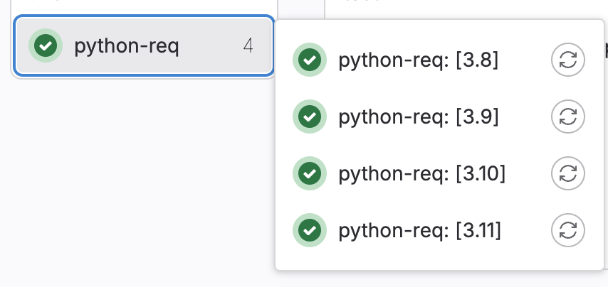

# 優化篇

## Matrix build

假設今天要跑測試，用不同的環境的 image 來跑，這時候就可以使用 matrix build 來做到。

```yaml
python-req:
  image: python:$VERSION
  stage: lint
  script:
    - pip install -r requirements_dev.txt
    - chmod +x ./build_cpp.sh
    - ./build_cpp.sh
  parallel:
    matrix:
      - VERSION: ['3.8', '3.9', '3.10', '3.11'] 
```
