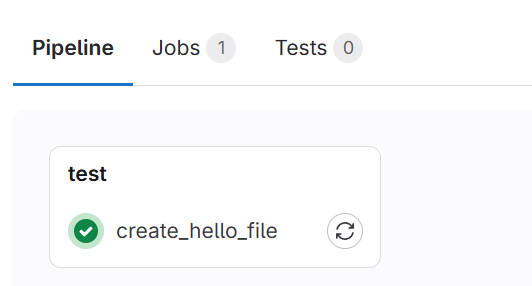

# 在自己的 server 上註冊 gitlab runner

如果想要讓 .gitlab-ci.yml 的 script 跑在自己的 server 上，可以參考以下步驟：

* 在 server 上安裝 gitlab runner

* 到 repo 註冊 server 上的 gitlab runner，表示若該 repo 指定用這個 runner 跑 CI/CD，則會跑在 server 上。

* 在 .gitlab-ci.yml 中指定 runner tag

## 目錄

* [安裝 gitlab runner](#安裝-gitlab-runner)

* [註冊 gitlab runner](#註冊-gitlab-runner)

* [使用 runner tag (指定註冊的 runner 來承接 Job)](#使用-runner-tag-指定註冊的-runner-來承接-job)

* [列出 server 上註冊過的 runner & 確認 runner 是否活著](#列出-server-上註冊過的-runner--確認-runner-是否活著)

* [移除 runner](#移除-runner)

## 安裝 gitlab runner

> [official doc](https://docs.gitlab.com/runner/install/)

```bash
curl -L "https://packages.gitlab.com/install/repositories/runner/gitlab-runner/script.deb.sh" | sudo bash
```

```bash
sudo apt install gitlab-runner
```

```bash
sudo systemctl enable gitlab-runner
sudo systemctl status gitlab-runner
```

## 註冊 gitlab runner

> 事前需準備一個 gitlab repo

```bash
sudo gitlab-runner register
```
> 輸入指令後，會出現一些提示，依照提示填入即可：

* Enter the GitLab instance URL (for example, https://gitlab.com/):
  * 自建的 gitlab server url：`http://your-gitlab-server.com/`
  * 使用 GitLab.com：`
  
* Enter the registration token:
  * 在 GitLab 的 repo 中，進入 `Settings` -> `CI/CD` -> `Runners`，找到 `Project runners` 區塊，在「New Project Runner」旁邊有三個點，按下去之後複製 token 回到 terminal 貼上。

* Enter a description for the runner:
  * 這個 runner 的描述，例如：`my vm runner`
  
* Enter tags for the runner (comma-separated):
  * 給予 runner 的 tag，例如：`my-vm-runner`

* Enter an optional maintenance note for the runner.
  * 沒特定需求直接 Enter

* Enter the executor:
  * executor 種類有很多種，可參考[官網](https://docs.gitlab.com/runner/executors/)挑選，這邊選擇 `shell`
  * 常見 executor：
    * shell：直接在特定 server 上跑 shell command，須事前在 server 上搞定 gitlab-runner 的權限問題與安裝會用到的指令。
    * ssh：功能和 shell 一樣，但是透過 ssh 連線到 server 上跑 script，須事前在 server 上搞定 ssh 的相關設定。 
    * docker：在 docker container 中跑 script，須事前在 server 上安裝 docker，並在 .gitlab-ci.yml 中指定 docker container 的 image。
    * kubernetes：在 k8s 中跑 script(通常是 k8s 相關操作)，須事前在 server 上安裝 k8s。

  * Gitlab repo --> gitlab-runner --> executor 的關係像是：老闆 --> 工人 --> 工作方式

  * 註冊完成後，可以在 GitLab 的 repo 中，進入 `Settings` -> `CI/CD` -> `Runners`，看到剛剛註冊的 runner。

## 使用 runner tag (指定註冊的 runner 來承接 Job)

* 編輯 .gitlab-ci.yml：

```bash
cd  <your-repo>
vim .gitlab-ci.yml
```
```yaml
create_hello_file:
  tags:
    - my-vm-runner
  script:
    - echo "hello" > /tmp/hello.txt
```

> 在 push 後自動在 server 上的 /tmp/ 下產生 hello.txt 檔案。


* 提交變更：

```bash
git add .
git commit -m "create hello.txt"
git push
```

* 前往 Gitlab 確認 CI/CD 的 Job 是否有跑成功：



* 在 server 上查看 /tmp/ 下是否有 hello.txt 檔案：

```bash
cat /tmp/hello.txt
```


## 列出 server 上註冊過的 runner & 確認 runner 是否活著

* 列出 server 上註冊過的 runner：

```bash
gitlab-runner list
```

* 確認 runner 是否活著：

```bash
gitlab-runner verify
```

## 移除 runner

* 先列出 server 上註冊過的 runner：

```bash
gitlab-runner list
```
> 會看到 runner 的名稱、token、url 等資訊。

* 移除 runner：

```bash
gitlab-runner unregister --name <runner-name>
```

or 

```bash
gitlab-runner unregister --url <runner-url> --token <runner-token>
```


