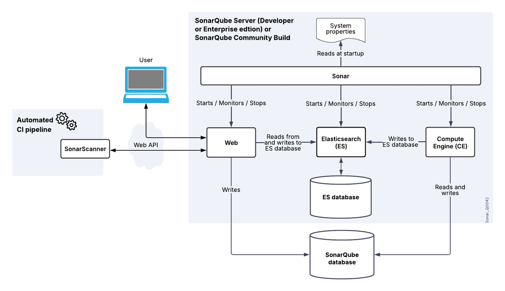

# SonarQube

SonarQube 是一套靜態程式碼分析平台，用於掃描程式碼並識別 Bug、安全漏洞與可維護性問題。整合至 CI/CD 後，可在每次 push 時自動執行分析，於程式碼進入主線前攔截品質問題。

本文聚焦在 SonarQube 本身（介紹、部署、設定檔、Quality Gate）；GitLab CI/CD 整合與結果判讀見後續章節。

## 目錄

- [SonarQube 簡介](#sonarqube-簡介)
- [運作架構](#運作架構)
- [部署 SonarQube：Docker Compose + PostgreSQL](#部署-sonarqubedocker-compose--postgresql)
- [Scanner 介紹](#scanner-介紹)
- [設定檔總覽](#設定檔總覽)
- [Quality Gate 入門](#quality-gate-入門)
- [常見維運提醒](#常見維運提醒)

---

## SonarQube 簡介

### 核心概念

| 名詞 | 說明 |
|------|------|
| **Bug** | 會導致程式執行錯誤或不預期行為的程式碼缺陷 |
| **Vulnerability** | 安全漏洞（SQL injection、未驗證的輸入等），需立即修復 |
| **Security Hotspot** | 安全敏感的程式碼段，需**人工判斷**是否構成真正風險 |
| **Code Smell** | 不影響功能但影響**可讀性與可維護性**的壞味道 |
| **Coverage** | 測試涵蓋率（需專案另外產 coverage report 給 SonarQube 讀） |
| **Quality Gate** | 一組品質門檻條件，全部通過才算過關 |

Quality Gate 是 SonarQube 在 CI/CD 中最核心的機制：分析結果未達門檻即可讓 pipeline 失敗，阻止問題程式碼合入主線。

### SonarQube vs SonarCloud

- **SonarQube**：自架版本，需自行管理 Server、資料庫與升級流程
- **SonarCloud**：SonarSource 提供的 SaaS 版本，開源免費、私有付費

兩者底層分析引擎相同，本文以自架的 SonarQube 為主。

### Community Build vs Developer Edition

| 功能 | Community Build (免費) | Developer Edition (付費) |
|------|----------------------|------------------------|
| 靜態分析 | ✅ | ✅ |
| Quality Gate | ✅ | ✅ |
| 支援語言 | 20+ | 30+ |
| Branch Analysis | ❌ | ✅ |
| PR Decoration（MR 介面看分析結果） | ❌ | ✅ |

Community Build 最大限制是**只能分析主線**，無法針對 feature branch 或 MR 做個別分析。需要每個 MR 獨立結果就必須升 Developer Edition、改用 SonarCloud，或接受非官方第三方 plugin（[06-mr-pr-integration.md](06-mr-pr-integration.md)）的風險。

### Community Build 在分支上的實務行為

「不支援分支分析」並不代表 scanner 無法在 feature branch 執行，而是：

- Scanner 仍可正常分析並上傳結果
- 同一個 `projectKey` 僅保留**一份**分析資料
- 不同 branch 的分析結果會**互相覆蓋**

例如 feature branch 掃完後，再掃 main 就會把 feature branch 的結果覆蓋掉。

三種實務做法：

1. **只在 main 跑**（官方建議）：`.gitlab-ci.yml` 用 `rules:` 限制只有 main 才掃，feature branch 不掃。Quality Gate 把關放在合入 main 後做
2. **每個 branch 用不同 projectKey**：CI 動態組 `sonar.projectKey=$CI_PROJECT_NAME-$CI_COMMIT_REF_SLUG`。代價是 Server 上會堆出一堆專案，是 hack 不是正規做法，**不推薦**
3. **第三方 plugin 解鎖 branch / PR analysis**：見 [06-mr-pr-integration.md](06-mr-pr-integration.md)

---

## 運作架構

> [官方文件：Server components overview](https://docs.sonarsource.com/sonarqube-community-build/server-installation/server-components-overview/)

SonarQube Server 由四個核心組件構成：

| 組件 | 用途 |
|------|------|
| **Web Server** | 唯一面向外部的入口。瀏覽器、IDE 插件、CI 系統透過 HTTP 連入，提供 UI 與 REST API；本身不做繁重計算 |
| **Compute Engine (CE)** | 處理 scanner 送來的分析報告，計算 issue / coverage / 重複率等指標後寫入 DB。任務佇列存在 DB，CE 重啟不會遺失任務 |
| **Elasticsearch (ES)** | 快取索引角色。DB 是 source of truth，搜尋走 ES 加速；ES 資料可從 DB 重建，是可拋棄副本 |
| **SonarQube Database** | 整個系統的核心儲存：metric、issue、設定、CE 任務佇列。官方建議 PostgreSQL，H2 僅供本機試玩 |

整體流程：



Quality Gate 的判定發生在 CE 處理完成後。CI 若要等結果，必須加：

```bash
-Dsonar.qualitygate.wait=true
```

---

## 部署 SonarQube：Docker Compose + PostgreSQL

內建 H2 僅適用測試與 Demo，正式部署用 PostgreSQL。

### Linux Host 預先設定

Elasticsearch 對 kernel 參數有硬性要求（[官方 Linux 預先設定文件](https://docs.sonarsource.com/sonarqube-community-build/server-installation/pre-installation/linux/)）：

**`/etc/sysctl.d/99-sonarqube.conf`**

```conf
vm.max_map_count=524288
fs.file-max=131072
```

**`/etc/security/limits.d/99-sonarqube.conf`**

```conf
sonarqube   -   nofile   131072
sonarqube   -   nproc    8192
```

套用：

```bash
sudo sysctl --system
```

limits 需要該使用者重新登入才會生效。

- `vm.max_map_count` / `nofile`：Elasticsearch 需大量 memory map 與 file descriptor，不夠就拒絕啟動
- `nproc`：CE 與 Web Server 並行 thread 上限
- **Kernel 必須啟用 seccomp**：`grep SECCOMP /boot/config-$(uname -r)` 應有 `CONFIG_SECCOMP=y`，主流發行版預設都開

> Docker Desktop（Windows / macOS）的容器跑在內部 Linux VM 裡，要設的是該 VM 的參數，不是宿主。學習可用，正式環境請改用 Linux server。

### docker-compose.yml 範例

下列範例使用 [`mc1arke/sonarqube-with-community-branch-plugin`](https://github.com/mc1arke/sonarqube-community-branch-plugin) 映像（非官方第三方 plugin，解鎖 branch analysis 與 PR decoration，詳見 [06-mr-pr-integration.md](./06-mr-pr-integration.md)）。

純官方版本只要把 `image` 改回 `sonarqube:community`、移除 `sonarqube_extensions` volume 即可；官方範本見 [SonarSource docker-sonarqube repo](https://github.com/SonarSource/docker-sonarqube/tree/master/example-compose-files/sq-with-postgres)。

```yaml
services:
  sonarqube:
    image: mc1arke/sonarqube-with-community-branch-plugin:26.4.0.121862-community
    container_name: sonarqube
    depends_on:
      db:
        condition: service_healthy
    read_only: true
    environment:
      SONAR_JDBC_URL: jdbc:postgresql://db:5432/sonar
      SONAR_JDBC_USERNAME: admin
      SONAR_JDBC_PASSWORD: admin
    volumes:
      - sonarqube_data:/opt/sonarqube/data
      - sonarqube_extensions:/opt/sonarqube/extensions
      - sonarqube_logs:/opt/sonarqube/logs
      - sonarqube_temp:/opt/sonarqube/temp
    tmpfs:
      - /tmp:size=256M,mode=1777
    ports:
      - "9000:9000"

  db:
    image: postgres:17
    container_name: sonarqube-db
    environment:
      POSTGRES_USER: admin
      POSTGRES_PASSWORD: admin
      POSTGRES_DB: sonar
    volumes:
      - postgresql:/var/lib/postgresql
      - postgresql:/var/lib/postgresql/data
    healthcheck:
      test: ["CMD-SHELL", "pg_isready -d $${POSTGRES_DB} -U $${POSTGRES_USER}"]
      interval: 10s
      timeout: 5s
      retries: 5

volumes:
  sonarqube_data:
  sonarqube_extensions:
  sonarqube_logs:
  sonarqube_temp:
  postgresql:
```

幾個關鍵點：

- **必須用 named volume，不能用 bind mount**：官方文件明確說 bind mount 會讓 plugin 安裝失敗
- **四個 SonarQube volume 用途**：`data`（ES 索引與內部狀態）、`extensions`（plugin、JDBC driver）、`logs`（Web/CE/ES 三個 process 的 log）、`temp`（執行時暫存）
- **`read_only: true` + `tmpfs: /tmp`**：把 container root 設成唯讀、`/tmp` 走 tmpfs，是官方範本的安全建議
- **`depends_on: condition: service_healthy`**：先等 PostgreSQL `pg_isready` 通過 SQ 才啟動，避免連線重試失敗退出
- **`SONAR_JDBC_*`** 是 Server 認得的環境變數，等同 `sonar.properties` 對應欄位

> **⚠️ Volume 安全**
>
> 不要用 `docker compose down -v`、不要隨手 `docker system prune` 或 `docker volume prune`——SonarQube 的所有分析結果、issue 歷史、Quality Gate 設定都在 volume 裡，刪掉就全部歸零。

### 啟動與第一次登入

```bash
docker compose up -d
docker compose logs -f sonarqube
```

看到 `SonarQube is operational` 即啟動完成。開 `http://<host>:9000`，預設帳密 `admin` / `admin`，首次登入強制改密碼。

改完後到 **Administration → Security → Users** 為 CI 端產生 token。

### 升級流程

1. `docker compose down`（**不要** `-v`）
2. 改 `docker-compose.yml` 的 `image` tag
3. `docker compose up -d`，DB schema 由 SonarQube 自動 migrate
4. 看 logs 確認 migration 成功

**大版本升級前必須先備份 PostgreSQL**：

```bash
docker compose exec db pg_dump -U sonar sonar > sonar_backup_$(date +%F).sql
```

---

## Scanner 介紹

Scanner 負責分析原始碼、產生分析報告、上傳至 Server。種類依 build system 而定：

| 專案類型 | 對應 scanner | 設定檔放在 |
|----------|--------------|-----------|
| 通用（Python / JS / Go / PHP …） | **SonarScanner CLI** | `sonar-project.properties` |
| Maven 專案 | **SonarScanner for Maven** | `pom.xml` |
| Gradle 專案 | **SonarScanner for Gradle** | `build.gradle` |
| .NET 專案 | **SonarScanner for .NET** | 命令列參數 |

> [官方文件](https://docs.sonarsource.com/sonarqube-community-build/analyzing-source-code/scanners/sonarscanner/)警告：「**Don't use the SonarScanner CLI for projects built with Maven, Gradle, or .NET. Doing so will degrade the quality of your analysis.**」原因是 CLI 拿不到 build 過程的編譯產物（`.class`、bytecode），分析能做到的事就少了一截。

各 scanner 在 `.gitlab-ci.yml` 怎麼跑見 [02-gitlab-ci-integration.md](02-gitlab-ci-integration.md)。

---

## 設定檔總覽

SonarQube 相關設定檔分**Server 端**與 **Scanner 端**兩組：

- Server 端：給 SonarQube Server 自己讀（資料庫連線、port、LDAP 等）
- Scanner 端：告訴 scanner 「分析哪個專案、用什麼設定」，每個 build system 各有自己的設定檔

### Server 端：sonar.properties

`$SONARQUBE_HOME/conf/sonar.properties` 是 Server 主設定檔，常見欄位：

| 設定 | 用途 |
|------|------|
| `sonar.jdbc.url` | 資料庫連線字串，例 `jdbc:postgresql://db:5432/sonar` |
| `sonar.jdbc.username` / `sonar.jdbc.password` | 資料庫帳密 |
| `sonar.web.port` | Web Server port，預設 `9000` |
| `sonar.web.context` | 部署在子路徑時用（例如 `/sonarqube`） |
| `sonar.search.javaOpts` | Elasticsearch JVM 參數，大流量環境調 heap |

Docker 部署通常以環境變數覆蓋（不用自行配置 `sonar.properties`）：

| sonar.properties 欄位 | 對應環境變數 |
|----------------------|-------------|
| `sonar.jdbc.url` | `SONAR_JDBC_URL` |
| `sonar.jdbc.username` | `SONAR_JDBC_USERNAME` |
| `sonar.web.port` | `SONAR_WEB_PORT` |
| `sonar.web.context` | `SONAR_WEB_CONTEXT` |

> 另有 `$SONARQUBE_HOME/conf/wrapper.conf` 控制 Web / CE / ES 的 JVM wrapper 參數，一般部署不用碰。

### Scanner 端：sonar-project.properties

放在專案根目錄，**SonarScanner CLI** 在掃描時讀。Maven / Gradle 用各自 build script，**不需要**此檔。

**唯一必填**：`sonar.projectKey`（必須對得上 Server 上的 project key）

常用欄位：

| 設定 | 預設 | 用途 |
|------|------|------|
| `sonar.projectName` | = `projectKey` | Dashboard 顯示名稱 |
| `sonar.sources` | `.` | 原始碼根目錄，實務一定要明確指定 |
| `sonar.tests` | （無） | 測試程式碼目錄，指定後分析規則才會切換 |
| `sonar.exclusions` | （無） | glob pattern，匹配到的檔案**完全不掃**（例 `**/node_modules/**`） |
| `sonar.coverage.exclusions` | （無） | 仍然掃描，但**不算進涵蓋率分母**（適合 generated code） |
| `sonar.sourceEncoding` | 系統預設 | 建議寫 `UTF-8` |

語言特定常用欄位：

- `sonar.python.version=3.11`
- `sonar.java.binaries=target/classes`（Java 必填，指向 build 產出）
- `sonar.javascript.lcov.reportPaths=coverage/lcov.info`

**`sonar.token` 與 `sonar.host.url` 不應寫在此檔**——會 commit 進 git、token 等於洩漏。改用環境變數 `SONAR_TOKEN` / `SONAR_HOST_URL` 或 `-Dsonar.token=...` 命令列覆蓋。

完整範例（Python 專案）：

```properties
sonar.projectKey=my-python-app
sonar.projectName=My Python App

sonar.sources=src
sonar.tests=tests
sonar.sourceEncoding=UTF-8

sonar.python.version=3.11

sonar.exclusions=**/.venv/**,**/build/**,**/*_pb2.py
sonar.coverage.exclusions=**/migrations/**,**/*_pb2.py

sonar.python.coverage.reportPaths=coverage.xml
```

### Scanner 端：Maven / Gradle 設定

**Maven**：`pom.xml` 加 properties，掃描指令 `mvn sonar:sonar`：

```xml
<properties>
  <sonar.projectKey>my-project-key</sonar.projectKey>
  <sonar.host.url>http://your-sonarqube:9000</sonar.host.url>
</properties>
```

token 一樣用環境變數或 `-Dsonar.token=...`，**不要**寫進 `pom.xml`。

**Gradle**：`build.gradle` 套 plugin：

```groovy
plugins {
  id "org.sonarqube" version "5.1.0.4882"
}

sonar {
  properties {
    property "sonar.projectKey", "my-gradle-app"
    property "sonar.host.url", "http://your-sonarqube:9000"
  }
}
```

掃描指令 `./gradlew sonar`（搭配環境變數 `SONAR_TOKEN`）。

### Scanner 端：sonar-scanner.properties

`<scanner_install>/conf/sonar-scanner.properties` 是 CLI 的**全域**預設值（如固定的 `sonar.host.url`）。多數情境用環境變數就夠了，很少需要動。

---

## Quality Gate 入門

Quality Gate 是 SonarQube 的品質門檻——一組條件，全部通過才 Pass。

**Clean as You Code 哲學**：預設 Quality Gate **只看 New Code**，不糾結既有技術債。團隊可以從現狀往前推進，只要新寫的 code 乾淨，整體品質就會逐步改善。

**預設 "Sonar way"** 內建四個條件，全部只針對 New Code（[官方說明](https://docs.sonarsource.com/sonarqube-community-build/quality-standards-administration/managing-quality-gates/introduction-to-quality-gates/)）：

1. **No new issues are introduced**
2. **All new Security Hotspots are reviewed**
3. **New code test coverage ≥ 80%**
4. **Duplication in the new code ≤ 3%**

> 條件數值會因版本略有差異，以 Web UI 上 **Quality Gates → Sonar way** 顯示的為準。

Web UI 上：專案 Dashboard 頂端直接顯示 **Passed** / **Failed**，點進去能看到每條條件的實際數值與差距。

**讓 CI 因 Quality Gate 失敗而停下來**：scanner 預設不等結果就退出，要加 `-Dsonar.qualitygate.wait=true` 讓它持續 polling，QG 判定 Fail 時 scanner exit code 非零、pipeline 跟著失敗。

---

## 常見維運提醒

- **Token 種類**：影響範圍由大到小為 User Token > Global Analysis Token > Project Analysis Token。**官方建議用 Project Analysis Token**——外洩時只能用來掃那一個專案
- **備份重點**：PostgreSQL 用 `pg_dump`；`sonarqube_extensions` volume 保存 plugin 與 JDBC driver
- **Plugin / Marketplace**：Web UI 可裝 plugin，檔案會放進 `extensions` volume，**重啟 Server 才會生效**

---

下一步：[02-gitlab-ci-integration.md — 把 SonarQube 整合進 GitLab CI/CD pipeline](02-gitlab-ci-integration.md)。
