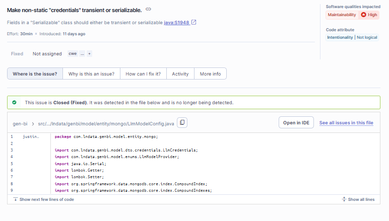

# SonarQube --- Quality Gate 與掃描結果判讀

[前一篇](02-gitlab-ci-integration.md) 把 pipeline 接好了，這篇處理「pipeline 跑完之後，Dashboard 顯示的數字怎麼讀、Quality Gate 沒過怎麼辦、跳過測試的專案怎麼活下來」。重點不在「設定 SonarQube」，而在「**看懂結果 + 把 Quality Gate 調成符合自己團隊現實的標準**」。

## 目錄

- [SonarQube --- Quality Gate 與掃描結果判讀](#sonarqube-----quality-gate-與掃描結果判讀)
  - [目錄](#目錄)
  - [看懂 SonarQube Dashboard](#看懂-sonarqube-dashboard)
    - [Quality Gate Passed / Failed 是什麼](#quality-gate-passed--failed-是什麼)
    - [New Code vs Overall Code](#new-code-vs-overall-code)
    - [Sonar way 的四個條件](#sonar-way-的四個條件)
    - [fudge factor 與「假性 pass」](#fudge-factor-與假性-pass)
  - [Quality Gate 在 CI 的把關](#quality-gate-在-ci-的把關)
    - [`sonar.qualitygate.wait=true` 機制](#sonarqualitygatewaittrue-機制)
  - [跳過測試的專案怎麼處理 Quality Gate](#跳過測試的專案怎麼處理-quality-gate)
    - [三個解法概覽](#三個解法概覽)
    - [建立自訂 Quality Gate 詳細步驟](#建立自訂-quality-gate-詳細步驟)
  - [Issues 與 Security Hotspots 的處理流程](#issues-與-security-hotspots-的處理流程)
    - [Issues 分類](#issues-分類)
    - [Issues 的處置動作](#issues-的處置動作)
    - [工程師處理一個 Issue 的標準流程](#工程師處理一個-issue-的標準流程)
      - [Step 1 — 鎖定要處理的子集](#step-1--鎖定要處理的子集)
      - [Step 2 — 讀懂這個 issue 在抱怨什麼](#step-2--讀懂這個-issue-在抱怨什麼)
      - [Step 3 — 三選一決定處置方式](#step-3--三選一決定處置方式)
      - [Step 4 — 推上 git 讓 SonarQube 重新驗證（路徑 a）](#step-4--推上-git-讓-sonarqube-重新驗證路徑-a)
      - [Step 5 — 確認 Quality Gate 變綠](#step-5--確認-quality-gate-變綠)
    - [Security Hotspots 的特殊流程](#security-hotspots-的特殊流程)
  - [Quality Gate 測試實戰](#quality-gate-測試實戰)
    - [為什麼第一次掃描總是 pass](#為什麼第一次掃描總是-pass)
    - [漸進採用：先 allow\_failure 後切 false](#漸進採用先-allow_failure-後切-false)
    - [模擬實際情境](#模擬實際情境)
  - [Branch / MR pipeline 行為](#branch--mr-pipeline-行為)
  - [Cache 與 GIT\_DEPTH 細節](#cache-與-git_depth-細節)
  - [Gradle 簡短範例](#gradle-簡短範例)
  - [常見錯誤排查](#常見錯誤排查)
  - [小結](#小結)

---

## 看懂 SonarQube Dashboard

進到專案 Overview 頁面看到的那些綠勾、紅圈、A/B/C 評等，背後的判定邏輯不直觀——尤其「明明沒寫測試，Quality Gate 卻 Passed」這種反直覺現象，幾乎是每個第一次接 SonarQube 的團隊都會遇到。本節把 Dashboard 上會看到的元素一個一個拆開。

### Quality Gate Passed / Failed 是什麼

Overview 頁最上方那個綠勾「Passed」或紅叉「Failed」，反映的是**最近一次掃描針對 New Code 的判定結果**。它不看 Overall Code、不看歷史、只看「這次掃描相對於 New Code 基準的差量」是否符合 Quality Gate 的所有條件。

* **Passed**：所有條件全過（包含被 fudge factor 自動跳過的條件）
* **Failed**：至少一條沒過

### New Code vs Overall Code

Dashboard 上會看到 `New Code` 與 `Overall Code` 兩個分頁，這兩個是**完全不同的視角**：

| 分頁 | 範圍 | Quality Gate 看不看 |
|------|------|---------------------|
| **New Code** | 自 New Code 基準以來新增/修改的部分 | **看**——QG 條件全部作用於這個範圍 |
| **Overall Code** | 整個 codebase 的當前狀態 | **不看**——只是給人類看現況用 |

兩者分開的設計呼應 [01-sonarqube.md 講過的 Clean as You Code 哲學](01-sonarqube.md#quality-gate-入門)：**不去糾結整個 codebase 既有的技術債，只要新寫的 code 乾淨，整體品質自然會慢慢變好**。

實際情境例子：

* Overall Code 顯示 `Coverage 0%, on 2.4k lines to cover` —— 全 codebase 沒測試，紅圈
* New Code 顯示 `Coverage -, on 0 lines to cover` —— 沒新增可覆蓋的 code，沒東西可測，QG 不擋
* → Quality Gate Passed，因為 QG 只看 New Code

換句話說：**Overall Code 的紅燈不會擋 pipeline，只會擋你良心**。

### Sonar way 的四個條件

預設的 Quality Gate 「Sonar way」（標記為 `Default` + `Built-in`，不可直接編輯）內建四個條件，全部歸在 **Conditions on New Code**——也就是只看 New Code、不看 Overall Code：

| 條件（Web UI 上的精確措辭） | 判定邏輯 |
|----------------------------|----------|
| **New code has 0 issues** | New Code 的 issue 數量必須等於 0（任何 severity、任何 software quality 都算）|
| **All new security hotspots are reviewed** | New Code 上所有 Security Hotspot 必須被人工 review 過（標為 Acknowledged / Fixed / Safe）|
| **New code has sufficient test coverage** | Coverage is greater than or equal to **80.0%** |
| **New code has limited duplications** | Duplicated Lines (%) is less than or equal to **3.0%** |

注意第一條是「count = 0」而不是「rating ≥ A」——任何新 issue 不分嚴重程度都會擋。這個門檻其實比看 rating 還嚴格。

> 條件數值（80% / 3%）會因 SonarQube 版本略有差異，請以你 Server **Quality Gates → Sonar way** 頁面顯示的為準。Sonar way 本身不能改，要客製化得按右上角 `Copy` 複製出來改（見[後面 §建立自訂 Quality Gate 詳細步驟](#建立自訂-quality-gate-詳細步驟)）。

### fudge factor 與「假性 pass」

[官方 Quality Gates 介紹文件](https://docs.sonarsource.com/sonarqube-community-build/quality-standards-administration/managing-quality-gates/introduction-to-quality-gates/) 寫明 fudge factor 的兩條規則：

> - The conditions on duplication are ignored until the number of new lines is at least 20.
> - The conditions on coverage are ignored until the number of new lines to cover is at least 20.

整理成表：

| 被影響的條件 | 觸發跳過的門檻 |
| --- | --- |
| Duplication 相關（如 `New code has limited duplications`） | 當次掃描的「新增行數」< 20 |
| Coverage 相關（如 `New code has sufficient test coverage`） | 當次掃描的「新增可覆蓋行數」< 20 |

換句話說：**小 commit（< 20 行）下，duplication 跟 coverage 這兩類條件會直接被忽略、不參與 Quality Gate 判定**。設計目的是避免 typo 修正、註解調整這類小變更因為比例失真（例如 1 行重複 / 1 行佔比 100%）就被擋下來。

> fudge factor 是 instance-wide 預設啟用的全域設定，所有新專案都會套用；專案管理員（Project Administrator）可在專案層級覆寫關閉。

對「導入 SonarQube 第一天就想看到嚴格把關」的團隊，fudge factor 很容易讓人誤以為「沒問題啊全綠」。要讓它不再遮蓋實際狀況，有兩條路：

1. 等實際有 PR 推上來、新增/修改的行數累積到 20 以上 → 該次掃描 duplication / coverage 兩類條件就會醒過來
2. 直接建一個自訂 Quality Gate **移掉 coverage 條件**，承認「這個專案不靠 coverage 把關」，改用其他三條（Issues / Hotspots / Duplications）擋——詳見[建立自訂 Quality Gate 詳細步驟](#建立自訂-quality-gate-詳細步驟)

> **第一次掃描為什麼幾乎都是 Passed？** 從 Quality Gate 的判定機制可以拆出四個事實：
>
> 1. **Quality Gate 只看 New Code**——Sonar way 四條條件全部列在 `Conditions on New Code` 底下（見[§Sonar way 的四個條件](#sonar-way-的四個條件)），與 Overall Code 上既有的 issue、hotspot、coverage 數字完全脫鉤。
> 2. **`New code has 0 issues` 與 `All new security hotspots are reviewed` 屬於 vacuously pass**——New Code 上沒有新 issue、沒有新 hotspot 時，兩條的待判定數量都是 0，自動過關。
> 3. **coverage 條件被 fudge factor 跳過**——如前述引文，新增可覆蓋行數 < 20 時整條條件被忽略。
> 4. **`New code has limited duplications` 同樣以 0% 通過**——沒有新增程式碼即沒有新重複。
>
> 至於「為什麼第一次掃描的 New Code 規模會這麼小」，精確機制因 New Code definition 的選擇而異（Previous version / Number of days / Reference branch 各自實作不同），本文不深入。實務上的驗證方式是切換到 Dashboard 的 `New Code` 分頁直接觀察數字：若 `Lines to cover` 為 0 或個位數、issue 數為 0，Quality Gate 必然 Passed，但此 Passed 不具任何把關意義。要實際觀察 Quality Gate 是否仍在運作，可依 [§模擬實際情境](#模擬實際情境) 推送一個 ≥ 20 行的 commit 進行驗證。

---

## Quality Gate 在 CI 的把關

### `sonar.qualitygate.wait=true` 機制

預設行為：scanner 把報告送到 Server 之後就退出，pipeline 永遠 pass——不管 Quality Gate 有沒有過。

加上 `-Dsonar.qualitygate.wait=true`（或在 pom.xml `<properties>` 設 `<sonar.qualitygate.wait>true</sonar.qualitygate.wait>`）之後：

* Scanner 持續 polling `/api/qualitygates/project_status` API
* Quality Gate 一旦判定為 Fail → scanner 的 exit code 非零 → pipeline fail
* 預設 timeout 300 秒，可以用 `-Dsonar.qualitygate.timeout=900` 拉長（CE 排隊太久時）

---

## 跳過測試的專案怎麼處理 Quality Gate

### 三個解法概覽

**問題**：

* 你 `-DskipTests` → 沒 coverage 報告 → 一旦 New Code 累積到 ≥ 20 行可覆蓋程式碼，SonarQube 看到「new code coverage 0%」
* 預設 Sonar way 第三條 `coverage on new code ≥ 80%` → 永遠 fail
* Pipeline 永遠紅 → 久了大家就把 sonar 當噪音、忽略它，**反而失去把關意義**

三個解法：

**選項一（推薦）：建立自訂 Quality Gate 移掉 coverage**

* 詳細步驟見下一節[建立自訂 Quality Gate 詳細步驟](#建立自訂-quality-gate-詳細步驟)
* 結果：QG 條件變成 Issues / Hotspots / Duplications 三條，沒測試也能 meaningful 把關

**選項二：靠 fudge factor 自動忽略（不推薦）**

[前一節](#fudge-factor-與假性-pass)已經講過 fudge factor。意思是當次掃描的新增可覆蓋行數 < 20 時，coverage 條件自動跳過。為什麼不推薦：稍微大一點的 PR（> 20 行）就會被觸發，pipeline 會莫名其妙紅起來，你還得回頭解釋為什麼 small commit 過得了、big commit 卻不行。

**選項三：補測試 + JaCoCo（長期方向）**

* 改回 `mvn verify`（不 skip）+ `pom.xml` 加 `jacoco-maven-plugin`
* JaCoCo 預設報告路徑 `target/site/jacoco/jacoco.xml`，`sonar-maven-plugin` **會自動偵測**，不用設 `sonar.coverage.jacoco.xmlReportPaths`
* 但這是「補測試 + 修 context-load 認證」的工程，超出本文範圍。詳見[官方 Java test coverage 文件](https://docs.sonarsource.com/sonarqube-community-build/analyzing-source-code/test-coverage/java-test-coverage/)

### 建立自訂 Quality Gate 詳細步驟

照 SonarQube Web UI 一步步走：

**Step 1 — 從預設 Sonar way 複製出來改**

`Quality Gates`（頂部導覽列）→ 點選 `Sonar way` → 右上角找 `Copy` 按鈕（不是 `Edit`，因為 Sonar way 是內建 gate 不能直接改）→ 取個有意義的名字，例如 `Sonar way (no coverage)` → 按 `Copy`

> 為什麼不從零開始建：複製可以保留「Reliability rating on new code = A」、「Security rating on new code = A」這些 issue / hotspot 相關的條件，避免漏掉。

<!--  -->

**Step 2 — 移除 coverage 條件**

進入剛複製出來的 `Sonar way (no coverage)` 頁面 → 在條件列表中找到 `New code has sufficient test coverage` 那一條 → 右側點 `Delete`（垃圾桶圖示）→ 確認

剩下的應該是 Sonar way 原本四條去掉 coverage 之後的三條：

* `New code has 0 issues`
* `All new security hotspots are reviewed`
* `New code has limited duplications`（Duplicated Lines ≤ 3.0%）


**Step 3 — 指派給專案**

進到目標專案（例如 `gen-bi`）→ 左側選單 `Project Settings → Quality Gate` → 從 `Default` 切到 `Always use a specific Quality Gate` → 下拉選 `Sonar way (no coverage)` → 按 `Save`


> 想把這個 gate 設成所有專案的全域預設？回到 `Quality Gates → Sonar way (no coverage) → Set as default`。但建議只在「絕大多數專案都跳過測試」的情境才這樣做，否則仍個別指派比較精準。

---

## Issues 與 Security Hotspots 的處理流程

Quality Gate 之外，Dashboard 還會列一堆 Issues 跟 Security Hotspots——這些是 SonarQube 找到但**不一定要立刻擋 pipeline** 的東西。本節說明怎麼處置它們。

### Issues 分類

每個 issue 有三個維度的屬性，會顯示在 issue 詳情頁的右側面板：**Software qualities impacted**（影響的 software quality 與對應 severity）、**Code attribute**（Clean Code 屬性）。

**Software Quality**（呼應 Overview 上的三個框，也對應 [01-sonarqube.md 核心概念表](01-sonarqube.md#核心概念)）：

| Software Quality | 意義 | 範例 |
|------------------|------|------|
| **Security** | 可被惡意利用的問題 | SQL injection、未驗證的輸入、硬編碼密碼 |
| **Reliability** | 程式執行時會出錯的問題 | NullPointerException 風險、未關閉的 resource、Logic 矛盾 |
| **Maintainability** | 影響可讀性 / 可維護性但不影響執行 | 過度複雜的函式、重複 code、Dead code |

一個 issue 可能同時影響多個 quality（這就是 `Software qualities impacted` 用複數的原因），每個 quality 各自會有 severity。

**Severity**（5 級，從高到低）：

| Severity | 意義 |
|----------|------|
| **Blocker** | 必修——會直接影響執行或構成嚴重風險 |
| **High** | 強烈建議修 |
| **Medium** | 該修，但可排程處理 |
| **Low** | 可修可不修——影響品質但不影響執行 |
| **Info** | 提醒等級 |

**Code attribute（Clean Code Attribute）**：每個 issue 還會帶一個 Clean Code 屬性標籤，分四大類，每類再細分數個子屬性（例如 `Intentionality | Not clear`、`Consistency | Conventional`）。屬性說明這個 issue 違反了乾淨程式的哪一面向：

| 大類 | 意義 |
| --- | --- |
| **Adaptability** | 程式碼是否容易因應變更 |
| **Consistency** | 是否遵循專案慣例與一致風格 |
| **Intentionality** | 寫的人意圖是否清楚（命名、邏輯表達） |
| **Responsibility** | 是否符合職責劃分（單一職責、邊界清楚） |

> Code attribute 是分類標籤，不參與 Quality Gate 條件判定，但 review issue 時可以用來理解「這條規則為什麼存在」。

在 `Issues` 分頁可以用左側面板按 **Software Quality / Severity / Scope (new code or all code) / Status / Assignee / File** 多維度過濾，找到要修的子集。

### Issues 的處置動作

Issue 詳情頁左下角的 `Open ⌄` 下拉選單可以切換狀態，實機選項如下：

| 狀態 | 意義 | 對 Quality Gate 的影響 |
| --- | --- | --- |
| **Open** | 預設狀態，剛被偵測到 | 計入 |
| **Accept** | 知道這個 issue 但決定不立即修 | **不再計入** |
| **False Positive** | 分析結果不對、誤報 | **不再計入** |

> Overview 頁的 `Accepted issues` 計數就是被標為 `Accept` 的 issue 數量。修好程式碼後 SonarQube 在下次掃描自動把對應 issue 轉為 `Closed`，不需手動標記。

**重點**：標 `False Positive` 或 `Accept` 之後，那個 issue 不再列入 Quality Gate 判定；但需要 `Administer Issues` 權限才能標——避免有人為了讓 pipeline 過綠把所有 issue 都標 False Positive。

### 工程師處理一個 Issue 的標準流程

把一個 issue 從「列表上的紅點」處理到「Quality Gate 不再卡」，照這個順序走：

#### Step 1 — 鎖定要處理的子集

`Projects → 該專案 → Issues` 進入列表，左側 filter panel：

1. 勾 `Issues in new code`——優先處理 New Code 上的 issue（QG 只看這個範圍，CI 直接擋的就是它們）
2. `Software Quality` 區塊先看 `Security` 跟 `Reliability` 的數字（這兩類比 Maintainability 嚴重）
3. `Severity` 區塊先選 `Blocker` + `High`（Medium / Low 留到有空再說）

剩下來的列表才是當天必須處理的子集。

#### Step 2 — 讀懂這個 issue 在抱怨什麼

點 issue 標題進入詳情頁，看四個地方：

- **左上方規則連結**（例如 `java:S1710`）→ 點開會跳到 SonarSource 規則文件，內容比 Web UI 詳細，且附 compliant / non-compliant 範例
- **右側 `Software qualities impacted`**：顯示影響哪些 Software Quality 與對應 Severity（一個 issue 可能同時影響多個 quality）
- **右側 `Code attribute`**：例如 `Intentionality | Not clear`，說明這條規則保護的是哪個 Clean Code 面向
- **詳情頁三個 tab**：
  - `Why is this an issue?`——規則設計動機與背景
  - `How can I fix it?`——如果規則作者有寫，會給修法範例
  - `More info`——相關 CWE / OWASP 等外部標準引用

#### Step 3 — 三選一決定處置方式

讀完之後，這個 issue 只會走三條路其中一條：

| 路徑 | 何時用 | 動作 |
| --- | --- | --- |
| **(a) 改程式碼修掉** | 規則確實點出實際問題 | 在 IDE 打開 `Line affected: Lxx` 指出的檔案與行，依 `How can I fix it?` 修改 |
| **(b) 標 `False Positive`** | 分析誤判、規則在這個 context 不適用 | `Open ⌄` → `False Positive`，並在 comment 寫明為什麼是誤報 |
| **(c) 標 `Accept`** | 知道是真問題但這次不修（時程、技術債、優先級） | `Open ⌄` → `Accept`，comment 寫明後續處理計畫或不修的原因 |

(b) 跟 (c) 都需要 `Administer Issues` 權限，且都會留下 audit trail（誰、何時、為什麼）。

#### Step 4 — 推上 git 讓 SonarQube 重新驗證（路徑 a）

- `git commit` + `git push` → pipeline 重跑 → SonarQube 重新掃描
- 修好的 issue 在新一次掃描中會自動轉為 `Fixed`（因為對應的程式碼已不存在問題）

例如以下截圖：



> 流程：打開 sonar dashborad 確認 issue -> 修改 -> commit & push -> pipeline 跑完後 issue 自動變成 Fixed 

#### Step 5 — 確認 Quality Gate 變綠

`Project Overview → New Code` 分頁，確認：

- `New issues` 數字降到 0（或目標值）
- Quality Gate 從 `Failed` 變 `Passed`
- 對應的 GitLab pipeline 從紅變綠（如果有設 `sonar.qualitygate.wait=true`）

> 若標 `False Positive` / `Accept` 之後 QG 仍 fail，先確認 `Issues in new code` filter 的剩餘數字——可能還有其他 issue 沒處理。

### Security Hotspots 的特殊流程

Security Hotspot **不等於** Vulnerability：

* **Vulnerability**：SonarQube 確定是漏洞 → 直接列為 Issue → 修就對了
* **Security Hotspot**：SonarQube 看到敏感程式碼模式（例如使用了 `Math.random()`、開啟 SSL 設定、處理使用者上傳的檔名），**但沒辦法判斷在你的專案 context 下到底是不是漏洞** → 需要人工判斷

舉例：用 `Math.random()` 在「產生遊戲動畫亂數」context 下沒問題，在「產生 session token」context 下就是嚴重漏洞——機器看不出差別，所以丟給人 review。

**Hotspot 的四個平行狀態**（對應 `Security Hotspots` 頁面上方四個分頁）：

| 狀態 | 意義 |
| --- | --- |
| **To review** | 預設，等人 review |
| **Acknowledged** | 看過了、知道有風險，但目前接受（例如記錄下來之後處理） |
| **Fixed** | 已修掉風險 |
| **Safe** | review 過、確認在這個 context 下不是真風險 |

> Hotspot 的狀態跟 Issue 不同——四個是**平行**狀態，不是「Reviewed 的子分類」。Web UI 上是四個分頁互相切換，不會出現「Reviewed → Acknowledged」這種兩段式描述。

**Hotspot 還會用兩個維度分組顯示**：

- **Review priority**：High / Medium / Low——SonarQube 給的優先級建議（不是 severity）
- **Category**：實際安全類別，例如 `SQL Injection`、`Denial of Service (DoS)`、`Weak Cryptography`、`Insecure Configuration`

`Security Hotspots` 頁面預設按 `Review priority` 由高到低分組，再依 `Category` 收合。

**Sonar way 第二條 `All new security hotspots are reviewed`** 要求 New Code 上的 Hotspot 100% 從 `To review` 移到其他三個狀態之一（不論 Acknowledged / Fixed / Safe）。實務流程：

1. 進 `Security Hotspots` 分頁，從 `To review` 看起，依 Review priority 由 High 開始
2. 點開單一 hotspot，依序看詳情頁五個 tab：
    - `Where is the risk?`——指出實際的程式碼位置
    - `What's the risk?`——說明這類模式可能造成什麼安全問題
    - `Assess the risk?`——列出評估時要檢查的項目（例如「這個輸入有沒有 sanitize」）
    - `How can I fix it?`——若需要修，建議的修法
    - `Activity`——歷史變更紀錄
3. 判斷後在右上 `Review` 按鈕選 `Acknowledged` / `Fixed` / `Safe`，並寫一句 comment 留紀錄
4. Quality Gate 對 Hotspot 的把關從此消除（直到下次有新 Hotspot 進入 New Code）

> Overview 上的 Security Hotspots 評等與「review 完成度」直接掛鉤——例如顯示 `Security Hotspots: 4, E` 即表示 4 個 hotspot 全在 `To review`，評等被打到 E（最差）；逐個 review 之後評等會回升到 A。Hotspot 被 review 過跟「程式有沒有真的修」是兩件事——SonarQube 在意的是「人有沒有看過並做出判斷」。

---

## Quality Gate 測試實戰

理論講完了，本節用實際操作走一遍。

### 為什麼第一次掃描總是 pass

機制詳見前面 [§fudge factor 與「假性 pass」](#fudge-factor-與假性-pass) 的 callout——簡單說就是 New Code 太小（或為空），四條 QG 條件不是 vacuously pass 就是被 fudge factor 跳過。

所以第一次接好 SonarQube、跑完一次 pipeline 看到綠勾，**先別開香檳**——這只代表「pipeline 跟 SonarQube 之間的水管通了」，不代表「QG 已經能把關」。

驗證水管通的訊號其實只要兩個：

* SonarQube Dashboard 出現專案、有 Lines of Code 數字
* GitLab pipeline 顯示 `sonarqube-check` job 成功、不是錯誤訊息

### 漸進採用：先 allow_failure 後切 false

實務上不要一上來就把 `allow_failure: false` 跟 `qualitygate.wait=true` 同時打開——你還沒看過分析結果、沒調好 QG 條件，pipeline 一定紅一片。建議節奏：

1. **第一階段**：`allow_failure: true` + `qualitygate.wait=true`
   * Pipeline 不會被擋，但你能看到 QG 結果（job log 會印 `QUALITY GATE STATUS: PASSED/FAILED`）
   * 跑幾次、看 Dashboard、決定要用預設還是自訂 QG（多半是切自訂、移掉 coverage）
2. **第二階段**：QG 設成能合理通過之後，切 `allow_failure: false`
   * 正式把關，QG fail 就擋 pipeline

切換時機判斷：連續 3 ~ 5 次 push 都 Quality Gate Passed，且每次都是「真的 pass」（不是因為 fudge factor 跳過）→ 可以切了。

### 模擬實際情境

要真的看到 Quality Gate 從 pass 切換成 fail，最快的方式是：

1. 在 repo 加一個新 Java 檔，內容塞 30 行以上的 method（**且這些行都是可覆蓋的**——不能只是 imports、空行、註解）
2. push 到分析線（例如 `test-va`）→ 觸發 pipeline
3. SonarQube 掃完 → 進 Project → New Code 分頁
4. 應該看到：
   * `New Code Lines: 30+`
   * `Coverage on New Code: 0.0%`（紅，因為跳過測試）
   * Quality Gate **Failed**（如果你還在用預設 Sonar way）

這時候你的 pipeline——

* 如果還是 `allow_failure: true` → 黃色警告但不擋
* 如果切到 `allow_failure: false` → 紅色失敗

這是讓你**確認 fudge factor 已經過了**、QG 真的在做事的最直接方法。看到這個結果之後，再去切自訂 QG 移掉 coverage，重跑就會 pass。

---

## Branch / MR pipeline 行為

[01-sonarqube.md `### Community Build 在分支上的實務行為`](01-sonarqube.md#community-build-在分支上的實務行為) 已經說明過：Community Build 同一個 `projectKey` 只保留一份分析結果，從不同 branch 推上來會互相覆蓋。

**推薦做法**：用 `rules:` 限制只在「主分析線」跑：

```yaml
rules:
  - if: $CI_COMMIT_BRANCH == "test-va" && $CI_PIPELINE_SOURCE == "push"
```

* 公司把 `test-va` 當主分析線（先合到 `test-va` 跑整合測試，再合到 `main`），所以 rule 鎖在 `test-va`
* `$CI_PIPELINE_SOURCE == "push"` 限定**只在 push event 觸發**——避免 MR pipeline、scheduled pipeline、API trigger 等其他情境跑掉

**想在每個 MR 上看到分析結果**：必須升 Developer Edition 或改用 SonarCloud，沒有免費的迴避方法。硬要在 MR 上跑分析的話，結果會跟主分析線互相覆蓋，Dashboard 變得毫無意義。

---

## Cache 與 GIT_DEPTH 細節

[02-gitlab-ci-integration.md 的 .gitlab-ci.yml 範例](02-gitlab-ci-integration.md#gitlab-ciyml-範例maven跳過測試) 裡 `cache` 與 `GIT_DEPTH` 兩段已經各放一句，這邊把背後的「為什麼」整理在一起：

* **`SONAR_USER_HOME` 為何要指到 `${CI_PROJECT_DIR}` 底下**
  GitLab CI 的 cache 機制只追蹤 project workspace 內的路徑。Scanner 預設用 `~/.sonar`（runner 容器的 home，不在 workspace），cache 抓不到，每次都要重新下載 plugin/analyzer。

* **cache.key 用 `$CI_COMMIT_REF_SLUG` 的取捨**
  按 branch 分 cache：同 branch 重複 commit 可重用、跨 branch 不污染。要更激進共用可以改成固定 key（例如 `"sonar-cache-shared"`），但這在 cache 內容版本不一致時會踩雷。

* **想加 Maven dependency cache**

  ```yaml
  cache:
    paths:
      - "${SONAR_USER_HOME}/cache"
      - .m2/repository/
  ```

  注意 cache 大小，超過幾百 MB 之後上下載 cache 反而比直接下依賴慢。如果 dependency 很多，建議用 GitLab 的 [`MAVEN_OPTS=-Dmaven.repo.local=...`](https://docs.gitlab.com/ee/ci/caching/) 把 local repo 重定向到 `${CI_PROJECT_DIR}/.m2/repository`。

* **`GIT_DEPTH: "0"` 為什麼**

  GitLab Runner 預設只 clone 最近 20 個 commits（即 `GIT_DEPTH: 20`，shallow clone）以加速 pipeline；但 SonarQube 需要靠 `git blame` 取得每一行 code 的「最後修改 commit + 時間」，藉此判定哪些行屬於 New Code、哪些屬於 Overall Code。

  **舉例說明**：假設專案累積 200 個 commits，New Code 基準設為「Previous version」對應到 50 個 commits 之前。

  - **`GIT_DEPTH: 20`（預設）**：只有最近 20 個 commits 的 blame 資訊 → 50 個 commits 前的修改紀錄缺失 → SonarQube 無法判斷哪些行是「自上一版本以來修改的」→ scanner 印出 `Missing blame information for X files` warning，整個檔案可能被誤判為 New Code（或反之）
  - **`GIT_DEPTH: 0`**：完整 clone 全部 commits → blame 資訊完整 → New Code 判定準確

  錯判的具體影響：原本應該只看 38 行新增 code 的 Quality Gate，可能因為 blame 缺失被當成「整個 6.4k 行檔案都是新的」，於是 Issues / Coverage 數字爆炸、QG 莫名其妙 fail；反過來也可能某些真的新增的行被當成舊 code、漏掉把關。

  設 `GIT_DEPTH: "0"` 代價是 clone 變慢（大型 repo 可能多幾十秒），但對 SonarQube 是必要的——這也是 [02-gitlab-ci-integration.md 的範例 `.gitlab-ci.yml`](02-gitlab-ci-integration.md) 一定會帶這個變數的原因。

---

## Gradle 簡短範例

公司主要用 Maven，但 Gradle 專案的接法也類似。`build.gradle` 加 plugin：

```groovy
plugins {
  id "org.sonarqube" version "5.1.0.4882"
}

sonar {
  properties {
    property "sonar.projectKey", "my-gradle-app"
  }
}
```

`.gitlab-ci.yml`：

```yaml
sonarqube-check:
  image: gradle:8.10.0-jdk21
  variables:
    SONAR_USER_HOME: "${CI_PROJECT_DIR}/.sonar"
    GIT_DEPTH: "0"
  cache:
    key: "gradle-sonar-cache-$CI_COMMIT_REF_SLUG"
    paths:
      - "${SONAR_USER_HOME}/cache"
  script:
    - ./gradlew sonar -Dsonar.qualitygate.wait=true
  allow_failure: false
  rules:
    - if: $CI_COMMIT_BRANCH == "test-va" && $CI_PIPELINE_SOURCE == "push"
```

差別主要在：image 換成 `gradle`、scanner 不是 maven 那個 plugin 而是 `org.sonarqube` Gradle plugin、指令是 `./gradlew sonar`。其餘 cache、`SONAR_USER_HOME`、`GIT_DEPTH`、`rules` 概念都一樣。Plugin 最新版本去 [Gradle Plugin Portal](https://plugins.gradle.org/plugin/org.sonarqube) 查。

---

## 常見錯誤排查

| 錯誤訊息 | 原因 | 解法 |
|---------|------|------|
| `You're using version of scanner that requires JRE 21+` | image 的 JDK 版本不夠 | 換成 `maven:3.9-eclipse-temurin-21` |
| `Connection refused` / `Unknown host` | `SONAR_HOST_URL` 寫錯，或 GitLab Runner 連不到 SonarQube（內網 firewall） | 確認 URL；在 Runner 上 `curl $SONAR_HOST_URL/api/system/status` 確認連線 |
| `Not authorized` | `SONAR_TOKEN` 沒設、過期、勾了 Protected 但 branch 不是 protected、或 `sonar.projectKey` 對不上 | 重產 token、調整 branch 設定，並確認 pom.xml 的 projectKey 跟 SonarQube Server 上的完全一致 |
| `Coverage is 0% on new code` | 跳過測試的預期結果 | 依[跳過測試的專案怎麼處理 Quality Gate](#跳過測試的專案怎麼處理-quality-gate) 切自訂 QG |
| `Quality Gate timed out` | CE 排隊太久（大專案 / Server 忙） | 加 `-Dsonar.qualitygate.timeout=900` |
| `Missing blame information for X files` | Git history 不夠深 | 確認 `GIT_DEPTH: "0"` 已設 |
| `Project not found` | `sonar.projectKey` 跟 Server 上不一致 | 用 SonarQube Dashboard 上看到的 key 對齊 pom.xml / `-D` 參數 |

---

## 小結

* **Quality Gate 只看 New Code**——Overall Code 的紅燈不會擋 pipeline。第一次掃描幾乎一定 Passed，那是 fudge factor + 沒 New Code 基準造成的「假性 pass」，不是真的及格。
* **跳過測試的專案**要建自訂 Quality Gate 移掉 coverage 條件、改用 Issues / Hotspots / Duplications 三條把關，否則 pipeline 永遠紅、把關意義就消失了。
* **Issues 跟 Security Hotspots 的差別在誰判斷**：Issues 是 SonarQube 確定的問題、Hotspots 是它請你 review 的敏感程式碼。預設 Sonar way 要求 New Code 上的 Hotspots 100% Reviewed 才能 pass。

整套 SonarQube 介紹到這裡告一段落：[01](01-sonarqube.md) 部署、[02](02-gitlab-ci-integration.md) 接 GitLab CI、[03](03-quality-gate-and-results.md)（本篇）讀結果與調 Quality Gate。
