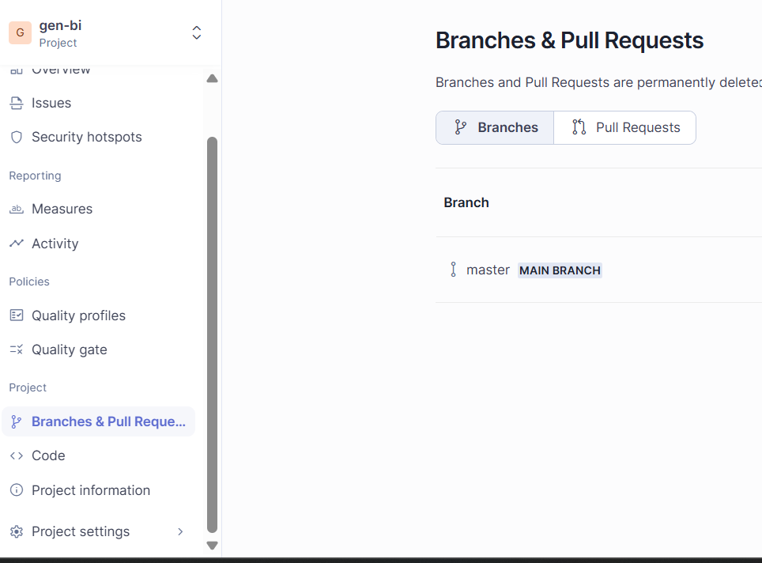
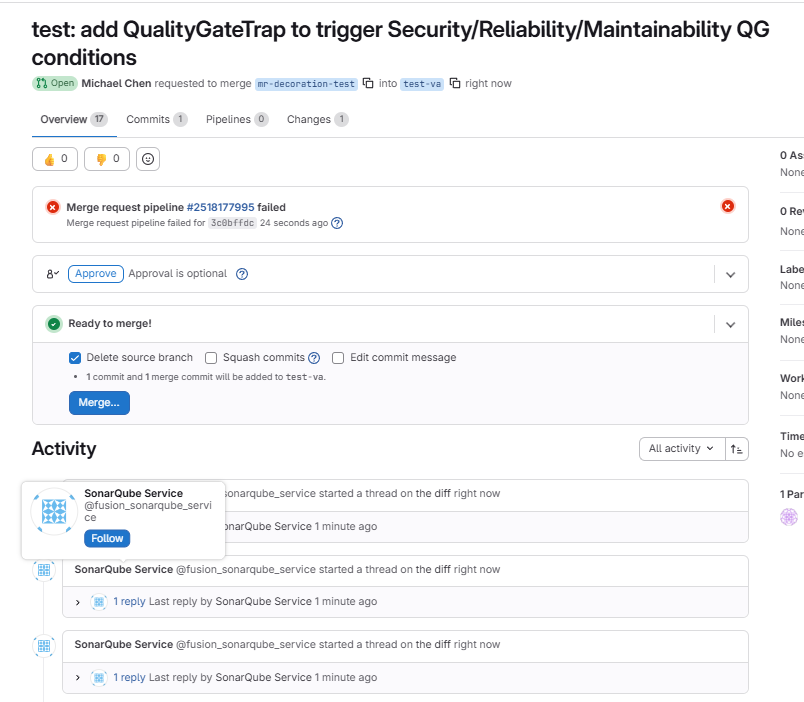
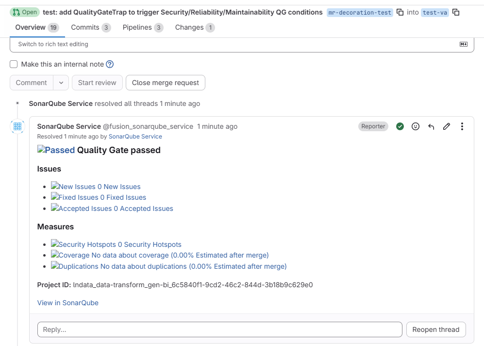

# SonarQube --- MR / PR 整合（用 community-branch-plugin 解鎖）

Community Build 官方不支援 branch analysis 與 MR decoration，因此一般做法是把 `.gitlab-ci.yml` 的 `rules:` 鎖在 `test-va` push，MR 階段不跑 SonarQube——開發者要等合進 `test-va` 才看得到分析結果。

社群第三方 plugin [mc1arke/sonarqube-community-branch-plugin](https://github.com/mc1arke/sonarqube-community-branch-plugin)（LGPL-3.0）能在 Community Build 上解鎖 branch analysis 與 PR decoration，效果接近 Developer Edition。本文以 SonarQube Community Build **v26.4.0** + plugin **v26.4.0** 為基準（major.minor 必須對齊）整理導入流程，並把第三方 plugin 的風險寫在最前面。

## 目錄

- [Plugin 解開了什麼、要付出什麼代價](#plugin-解開了什麼要付出什麼代價)
- [從官方 image 切換/安裝 plugin](#從官方-image-切換安裝-plugin)
  - [改 `docker-compose.yml`](#改-docker-composeyml)
  - [切換前必做 1：DB volume 對齊](#切換前必做-1db-volume-對齊)
  - [切換前必做 2：移除舊的 `sonarqube_extensions` volume](#切換前必做-2移除舊的-sonarqube_extensions-volume)
  - [切換後行為與啟動驗證](#切換後行為與啟動驗證)
  - [替代方案：官方 image 手動掛 plugin](#替代方案官方-image-手動掛-plugin)
- [確認 GitLab ALM Integration](#確認-gitlab-alm-integration)
- [修改 `.gitlab-ci.yml`](#修改-gitlab-ciyml)
- [端到端驗證](#端到端驗證)
- [New Code definition 的處置](#new-code-definition-的處置)
- [不裝 plugin 的 fallback](#不裝-plugin-的-fallback)
- [常見問題與升版](#常見問題與升版)

---

## Plugin 解開了什麼、要付出什麼代價

**解開的功能**

- 多分支 Dashboard 並存：不同 branch 的分析結果各自獨立儲存，不再互相覆蓋
- MR 上自動 inline comment：分析完成後以 Bot 身份在 GitLab MR 留言，列出 Quality Gate 狀態、新 issue 數、coverage
- `sonar.pullrequest.key / branch / base` 三件組可用，建立 PR analysis 而非 branch analysis
- 專案 UI 多出 `Branches` 與 `Pull Requests` 兩個 tab

**四條風險**

1. **非 SonarSource 官方維護**：plugin README 明寫不獲官方支援，SQ 論壇上遇 plugin bug 通常不會協助
2. **升 commercial edition 可能 lose data**：plugin 寫入的 branch / PR schema 不一定相容於 Developer/Enterprise Edition
3. **SQ 升版必須同步升 plugin**：major.minor 錯位可能讓 SQ 起不來；plugin 通常在 SQ 新版釋出後幾天內跟上
4. **LGPL-3.0 授權**：是否進 production 由團隊 legal/security 自評。Plugin 以 Java agent 形式注入 SQ 容器

**導入治理建議**：先在 PoC 跑至少兩週確認穩定再 promote 到 production；內部維護「SQ 版本 ↔ plugin 版本」對應表；預留退場路徑（拔 plugin 不會弄壞 main branch 資料，但 branch/PR 歷史會變不可見）。

---

## 從官方 image 切換/安裝 plugin

若原本用的是官方 `sonarqube:community` 或官方 compose 範本，本節說明如何替換以及會踩到的坑。

### 改 `docker-compose.yml`

對齊 [plugin 作者的 reference compose](https://github.com/mc1arke/sonarqube-community-branch-plugin/blob/master/docker-compose.yml)：

```yaml
services:
  sonarqube:
    image: mc1arke/sonarqube-with-community-branch-plugin:26.4.0.121862-community
    container_name: sonarqube
    depends_on:
      db:
        condition: service_healthy
    read_only: true
    environment:
      SONAR_JDBC_URL: jdbc:postgresql://db:5432/sonar
      SONAR_JDBC_USERNAME: admin
      SONAR_JDBC_PASSWORD: admin
    volumes:
      # 不持久化 /opt/sonarqube/extensions —— plugin 已烤進 image
      - sonarqube_data:/opt/sonarqube/data
      - sonarqube_logs:/opt/sonarqube/logs
      - sonarqube_temp:/opt/sonarqube/temp
    tmpfs:
      - /tmp:size=256M,mode=1777
    ports:
      - "9000:9000"

  db:
    image: postgres:17
    container_name: sonarqube-db
    environment:
      POSTGRES_USER: admin
      POSTGRES_PASSWORD: admin
      POSTGRES_DB: sonar
    volumes:
      # 雙 volume：第二行明確掛在 PGDATA，搶在 image VOLUME directive 之前
      - postgresql:/var/lib/postgresql
      - postgresql_data:/var/lib/postgresql/data
    healthcheck:
      test: ["CMD-SHELL", "pg_isready -d $${POSTGRES_DB} -U $${POSTGRES_USER}"]
      interval: 10s
      timeout: 5s
      retries: 5

volumes:
  sonarqube_data:
  sonarqube_logs:
  sonarqube_temp:
  postgresql:
  postgresql_data:
```

四個重點：

- **Java agent 已烤進 image**：`SONAR_WEB_JAVAADDITIONALOPTS` 與 `SONAR_CE_JAVAADDITIONALOPTS` 已在 image build 時塞好，compose 不必再加
- **版本鎖死**：image tag 含完整 build 號（`26.4.0.121862-community`），在 [Docker Hub tags](https://hub.docker.com/r/mc1arke/sonarqube-with-community-branch-plugin/tags) 確認後寫死
- **`sonarqube_extensions` volume 拿掉**：plugin 隨 image 烤入，持久化反而會踩 named-volume override bug（舊 volume 蓋過新 image 內容，plugin jar 「不見」、SQ 起不來）
- **db 改成雙 volume**：第二行 `postgresql_data:/var/lib/postgresql/data` 明確覆蓋 image 的 `VOLUME` directive，避免匿名 volume 被建立、container 重建時資料消失。第一行順便接父目錄雜物

改完 yaml **先不要 `docker compose up -d`**——既有部署需先處理下面兩節，跳過會丟資料或讓 SQ 起不來。

### 切換前必做 1：DB volume 對齊

PostgreSQL image 在 Dockerfile 內宣告 `VOLUME /var/lib/postgresql/data`。若 compose 沒明確覆蓋該路徑，Docker 會在 container 建立時自動建立匿名 volume 掛到 PGDATA，重建 container 即丟資料——這是官方 SQ compose 範本一直以來的隱性 bug。

新 yaml 用雙 volume 寫法修掉這個問題。既有部署需先檢查目前處於哪種狀態：

```bash
docker inspect sonarqube-db --format '{{json .Mounts}}' | jq
```

| 狀態 | 看到的 mount | 處置 |
|---|---|---|
| **A** 原始 bug | named at `/var/lib/postgresql` + hex 匿名 volume at `/var/lib/postgresql/data` | 走「狀態 A 救援」 |
| **B** 單行掛 PGDATA | 只有一個 named at `/var/lib/postgresql/data` | 走「狀態 B 遷移」 |
| **C** 已是雙 volume | 兩個 named，父目錄 + PGDATA | 直接跳到[必做 2](#切換前必做-2移除舊的-sonarqube_extensions-volume) |

**狀態 A 救援**：資料在 dangling 匿名 volume 上，要搬到新的 `postgresql_data`。

```bash
docker compose down

# 1. 找出 PGDATA 所在的匿名 volume
sudo bash -c '
for vol_dir in /var/lib/docker/volumes/[0-9a-f]*; do
  data="$vol_dir/_data"
  if [ -f "$data/PG_VERSION" ]; then
    echo "$(basename $vol_dir)  pgver=$(cat $data/PG_VERSION)  mtime=$(stat -c %y $data | cut -d. -f1)"
  fi
done | sort -k4
'
# 挑 pgver 對得上、mtime 最接近上次正常使用的 hex 名稱（記為 <OLD_HEX>）

# 2. 驗證是 SonarQube 的 DB（避免救錯）
docker run --rm -d --name pg-recovery-test \
  -v <OLD_HEX>:/var/lib/postgresql/data postgres:17
sleep 5
docker exec pg-recovery-test psql -U admin -d sonar -c \
  "SELECT count(*) FROM projects WHERE qualifier='TRK';"
docker stop pg-recovery-test

# 3. 把舊 volume 內容複製到新 postgresql_data
docker volume create <project>_postgresql_data
docker run --rm \
  -v <OLD_HEX>:/source:ro \
  -v <project>_postgresql_data:/dest \
  postgres:17 sh -c "cp -a /source/. /dest/"

# 4. 重建 postgresql 父目錄 volume（新 yaml 它角色變了，起步該是空的）
docker volume rm <project>_postgresql
docker volume create <project>_postgresql
```

第 3 步來源 read-only，舊匿名 volume 原封不動可重來。

**狀態 B 遷移**：舊 yaml 把 PGDATA 直接掛在 `postgresql` named volume，新 yaml 期望 `postgresql_data` 才是 PGDATA、`postgresql` 退居父目錄。

```bash
docker compose down

docker volume create <project>_postgresql_data
docker run --rm \
  -v <project>_postgresql:/source:ro \
  -v <project>_postgresql_data:/dest \
  postgres:17 sh -c "cp -a /source/. /dest/"

docker volume rm <project>_postgresql
docker volume create <project>_postgresql
```

**期間絕對不要做的事**

- 不要用 `docker compose down -v`：會把所有 named volume 砍掉
- 不要 `docker volume prune`：狀態 A 的 dangling volume 是救援素材
- 不要先砍 `<OLD_HEX>` 或舊 `postgresql`：等 SQ 起來、UI 看到專案完整後再清

### 切換前必做 2：移除舊的 `sonarqube_extensions` volume

新 yaml 不再持久化 `/opt/sonarqube/extensions`。既有部署若有這顆 volume，會在 yaml 改動後變 orphan——占空間、語意混淆，且若原本踩過 override bug，內部可能還有舊 plugin staging 檔。

```bash
docker compose down
docker volume ls | grep sonarqube
docker volume rm <project>_sonarqube_extensions
```

> 從 community-branch-plugin image 全新部署、沒踩過 override bug 的環境通常沒這顆 volume，可略過。

再次叮嚀：**不要用 `docker compose down -v`**，要砍就點名 `sonarqube_extensions`。

### 切換後行為與啟動驗證

`docker compose up -d` 之後 Compose 偵測到 `image:` 變更會 recreate 容器（不是 restart），首次拉新 image 約 1 GB，plugin jar 直接從 image 內 `/opt/sonarqube/extensions` 載入。

| Volume | 內容 | 切換後 |
|---|---|---|
| `sonarqube_data` | Elasticsearch indices、analysis cache | 保留 |
| `sonarqube_logs` | 日誌 | 保留 |
| `postgresql_data` | PGDATA（專案、issues、user、token、ALM config） | 保留（從必做 1 遷移或全新建立） |
| `postgresql` | postgres user home 雜物 | 保留 |

應用層資料全在 PGDATA，plugin / driver 跟著 image 走——「升 plugin = 換 image」一步到位。Downtime 約 **1–3 分鐘**（含 Elasticsearch 起 indices），建議挑離峰切換。

原 yaml `image: sonarqube:community` 沒帶版本，每次 pull 都可能拉最新；換成 `mc1arke/...:26.4.0.121862-community` 後版本被鎖死。鎖死本身是好事（避免錯位），代價是未來升 SQ 要手動同步升 plugin。

**啟動後驗證**：

- `docker compose logs -f sonarqube` 看到 `SonarQube is operational`
- `Administration > Marketplace > Installed` 列表中出現 `Community Branch Plugin`，版本與 SQ 對齊
- 開原有專案，左側選單多出 `Branches & Pull Requests` tab：
  
- 原專案 Dashboard 內容與 issue 數應完全保留；若顯示「沒有專案」，多半是[必做 1](#切換前必做-1db-volume-對齊) 漏做或做錯

### 替代方案：官方 image 手動掛 plugin

若 policy 不接受第三方預建 image，可用官方 `sonarqube:community` 為基底：

1. 從 [plugin release 頁](https://github.com/mc1arke/sonarqube-community-branch-plugin/releases) 下載對應版本 jar
2. 放進掛到 `/opt/sonarqube/extensions/plugins/` 的 volume
3. 在容器設 `SONAR_WEB_JAVAADDITIONALOPTS` 與 `SONAR_CE_JAVAADDITIONALOPTS`，指向 `-javaagent:...=web` 與 `=ce`
4. 新版 plugin 還會要求替換 `web/` 目錄為 plugin 提供的 `sonarqube-webapp.zip`——預建 image 已做完

細節見 [plugin README](https://github.com/mc1arke/sonarqube-community-branch-plugin#installation)。

---

## 確認 GitLab ALM Integration

Plugin 裝好後 scanner 已能跑 PR analysis，但要讓 SonarQube 主動 POST comment 回 GitLab MR，還需要：

1. SonarQube admin 層級設好 GitLab DevOps Platform Integration（存 PAT 用來呼叫 GitLab API）
2. 專案層級啟用 Pull Request Decoration、綁定 GitLab project ID（plugin 才會出現的區塊）

### 1. SonarQube 端的 GitLab DevOps Platform Integration

`Administration > Configuration > General Settings > DevOps Platform Integrations > GitLab > Create configuration`：

- `Configuration name`：自取，例 `Company GitLab`，專案層級會引用
- `GitLab API URL`：自架填 `https://gitlab.example.com/api/v4`、SaaS 填 `https://gitlab.com/api/v4`
- `Personal Access Token`：貼 Service Account PAT（scope `api`）

存檔後按 `Check Configuration`，綠勾即可。紅叉時排查順序：URL 結尾有沒有 `/api/v4` → PAT scope 是否含 `api` → Service Account 在目標 project 上至少 Reporter。

若先前匯入專案時已建過 configuration，此處只需確認存在、`Check Configuration` 仍綠即可，**token 不必重產**。

### 2. 專案層級綁定 Pull Request Decoration

到目標專案 `Project Settings > General Settings > DevOps Platform Integration`：

- `Configuration name`：選上一步建好的 configuration
- `Project ID`：填 GitLab project 首頁的**數字 ID**（不是 path 字串 `group/repo`）

存檔後 SonarQube 才知道「PR analysis 結果要 POST 到哪個 GitLab project」。透過 GitLab 匯入建立的專案通常自動帶好 Project ID；手動建立的需自己填。

---

## 修改 `.gitlab-ci.yml`

`rules:` 從一條擴成兩條，其他欄位（image、cache、`GIT_DEPTH`、tags）不動：

```yaml
rules:
  - if: $CI_PIPELINE_SOURCE == "merge_request_event"
  - if: $CI_COMMIT_BRANCH == "test-va" && $CI_PIPELINE_SOURCE == "push"
```

| Rule | 觸發時機 | SonarQube 端 |
|---|---|---|
| 第一條 | MR 開啟 / 更新 | 進 `Pull Requests` tab，建 PR analysis、留 MR comment |
| 第二條 | 合併進 `test-va` 後的 push | 進 `Branches` tab 的 `test-va`，更新該 branch dashboard |

Plugin 讓 PR analysis 與 branch analysis 分開儲存，兩條規則不互相覆蓋。副作用是一次完整 MR 流程（開 MR → push 修改 → merge）會觸發 **兩次** scanner，CI 耗時翻倍是必然成本。

**`sonar.pullrequest.*` 要不要顯式傳**

GitLab 預定義變數會被 SonarScanner 5.x+ 自動讀取對應，理論上不必顯式傳。推薦先用 auto-detection：

```yaml
script:
  - mvn verify org.sonarsource.scanner.maven:sonar-maven-plugin:sonar -DskipTests
```

若 PR analysis 沒正確建立，再切顯式傳：

```yaml
script:
  - |
    if [ "$CI_PIPELINE_SOURCE" = "merge_request_event" ]; then
      mvn verify org.sonarsource.scanner.maven:sonar-maven-plugin:sonar -DskipTests \
        -Dsonar.pullrequest.key=$CI_MERGE_REQUEST_IID \
        -Dsonar.pullrequest.branch=$CI_MERGE_REQUEST_SOURCE_BRANCH_NAME \
        -Dsonar.pullrequest.base=$CI_MERGE_REQUEST_TARGET_BRANCH_NAME
    else
      mvn verify org.sonarsource.scanner.maven:sonar-maven-plugin:sonar -DskipTests
    fi
```

**`sonar.qualitygate.wait=true` 仍生效**：MR pipeline 跑出的 QG 狀態就是 job pass/fail。配合 `allow_failure: false` 與專案的 `Pipelines must succeed`，QG fail 即擋 merge——這是 plugin 路線「擋住 bad code」的真正機制，不依賴開發者主動去點 MR comment。

---

## 端到端驗證

從 dummy MR 走到底：

1. **開 MR**：feature branch 改一行，開 MR 對 `test-va`
   - GitLab pipeline 出現 sonar job
   - SonarQube `Pull Requests` tab 看到新 PR analysis
   - MR 介面下方出現 SonarQube bot comment（含 QG 狀態與 issue 數）
2. **推有問題的 commit**：故意加未使用變數
   - 新 issue 出現、bot comment 更新、QG fail → pipeline 紅
3. **修掉問題 → 重 push**：QG pass、pipeline 綠
4. **合併**：`test-va` push pipeline 跑第二次 sonar、`Branches` tab 更新、`Pull Requests` tab 標為已合併

第 1 步 bot comment 沒出現時的排查順序：

- SonarQube logs 有沒有 `Pull request decoration failed`
- ALM Integration 是否已設、`Check Configuration` 仍綠
- 專案層級 Project ID 是否正確（最常見錯：填了 path 字串而不是數字）
- Bot 帳號在該 GitLab project 上是否有 Reporter 權限

範例——先推一個有問題的 MR：


> reviewer 也會收到 email 通知，提醒去看 SonarQube comment

修復後：



---

## New Code definition 的處置

Plugin 解開的不只 MR decoration，**New Code 計算的精準度也改善**：

- **MR analysis 時**：scanner 收到 `sonar.pullrequest.base`（自動偵測為 `test-va`），plugin 把 New Code 定義為「MR 相對於 base branch 的差異」——Developer Edition 的原生行為
- **branch analysis 時**：沿用專案層級 New Code definition

**實務建議：保留 `Previous version`**。Plugin 在 MR 上下文會自動切換到「相對 base branch」的算法，不必為 plugin 改動專案層級設定。只有「`test-va` branch analysis 想用 reference branch 對比 `main`」這種特殊需求才需改。

---

## 不裝 plugin 的 fallback

若公司 policy 不接受第三方 plugin、或暫時不想承擔升 commercial 的 data loss 風險：

- **方案 A**：維持原 yaml，`rules:` 只鎖 `test-va` push，MR 階段不跑 SonarQube。代價是合併後才知道結果
- **方案 C**：MR 也跑 SonarQube 但接受 Dashboard 失真——同 projectKey 下 PR analysis 會與 branch analysis 互相覆蓋。要避免 New Code 基準失真，需把專案層級 New Code definition 改為 `Reference branch = test-va`

兩條 fallback 都不在本章主推範圍。

---

## 常見問題與升版

**Plugin 沒啟動 / SQ 起不來**

- log 出現 `Error opening zip file or JAR manifest missing` + `agent library failed Agent_OnLoad: instrument` → 舊 yaml 有 `sonarqube_extensions` mount，named-volume override 蓋住 image 內 plugin jar。見[必做 2](#切換前必做-2移除舊的-sonarqube_extensions-volume)
- 切換 image 後 SQ 起來但「所有專案不見了」→ db volume mount path bug。見[必做 1](#切換前必做-1db-volume-對齊)
- 拉不到 image：確認 tag 確實存在於 [Docker Hub](https://hub.docker.com/r/mc1arke/sonarqube-with-community-branch-plugin/tags)（少數 SQ build 可能延後幾天才出對應 plugin image）
- Marketplace 看不到 plugin：通常是手動掛 plugin 路徑下 `SONAR_*_JAVAADDITIONALOPTS` 沒設或路徑錯
- log 出現 `Could not find class`：plugin 與 SQ 版本錯位

**MR 沒有出現 SonarQube comment**

9 成是 Project ID 填錯（填了 path 字串）；其次是 bot 在 GitLab project 沒 Reporter；或 ALM Integration `Check Configuration` 紅叉。

**SonarQube 升版流程**

1. 先到 plugin release 頁確認對應 SQ 版本有 plugin release
2. 有：先升 plugin（換 image tag），確認運作後再升 SQ
3. 沒有：等 plugin release 出來再升，**不要**先升 SQ

內部維護「SQ 版本 ↔ plugin 版本 ↔ image tag」對應表。

**退場：移除 plugin 改回官方 image**

- image 改回 `sonarqube:community`、`docker compose up -d`
- branch / PR 歷史分析資料變不可見（資料在 DB，但官方 SQ 不認 plugin 寫入的 schema）
- main branch 分析結果、QG、token、user 都保留
- 徹底清乾淨需手動清 DB 中 plugin 寫入的表，plugin 文件未明說、不建議輕易執行
